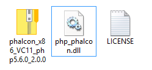
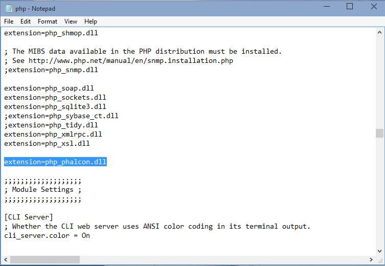
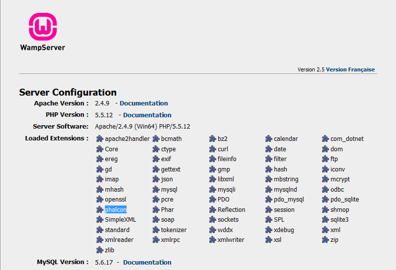

WAMP 下安装（Installation on WAMP）
===================================

WampServer_ 是一个windows版 Web 开发环境。它允许你通过使用Apache2，PHP和一个MySQL数据库来创建一个WEB应用。 下面是介绍如何在Windows版的WampServer上安装Phalcon的详细说明。强烈推荐使用最新版本的WampServer版本。

下载正确的 Phalcon 版本（Download the right version of Phalcon）
----------------------------------------------------------------
WAMP包含32位和64位版本。从下载页面，你可以根据你要的架构来选择下载不同的Windows版Phalcon。

下载Phalcon扩展之后，你将会看到一个如下图所示的zip文件：

.. figure:: ../_static/img/xampp-1.png
    :align: center

解压zip文件，你将会发现多了一个Phalcon DLL文件:

复制 php_phalcon.dll 文件到PHP扩展目录。如果你安装的WAMP在C:\wamp文件夹，那么该扩展需要放在C:\\wamp\\bin\\php\\php5.5.12\\ext目录中：

编辑 php.ini 文件， 它位于 C:\\wamp\\bin\\php\\php5.5.12\\php.ini。它可以使用记事本或者类似程序来编辑它。我们推荐使用Notepad++，来避免行尾问题。在文件的结束部分加上 extension=php_phalcon.dll 然后保存该文件。

同样也需要编辑另外一个php.ini文件，它位于C:\\wamp\\bin\\apache\\apache2.4.9\\bin\\php.ini。在文件的结束部分加上 extension=php_phalcon.dll 然后保存该文件。

重启Apache Web 服务器。 请在系统托盘部分点击WAMP图标。从快捷菜单中选择“Restart All Services”（重新启动所有服务），检测系统图标是否再一次的变成绿色。

.. figure:: ../_static/img/wamp-3.png
    :align: center

打开你的浏览器输入http://localhost并回车。将会出现WAMP的欢迎页面。查看“extenssion loaded”来检测Phalcon扩展是否正确加载了。

恭喜你，你已经成功的安装Phalcon扩展。

相关指南
--------------
* :doc:`普通安装 </reference/install>`
* :doc:`Windows版XMAPP安装说明 </reference/xampp>`

.. _WampServer: http://www.wampserver.com/en/
