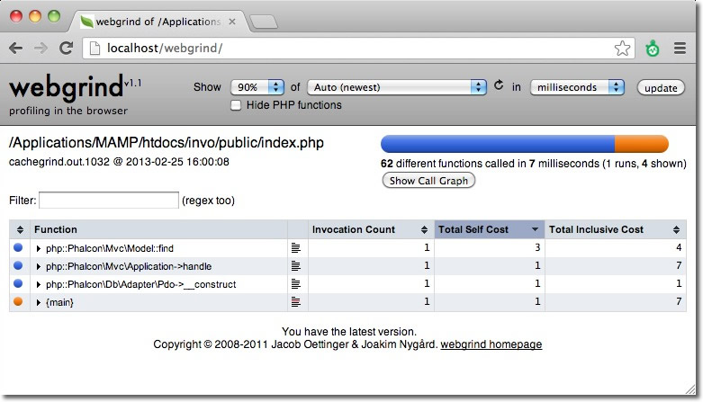
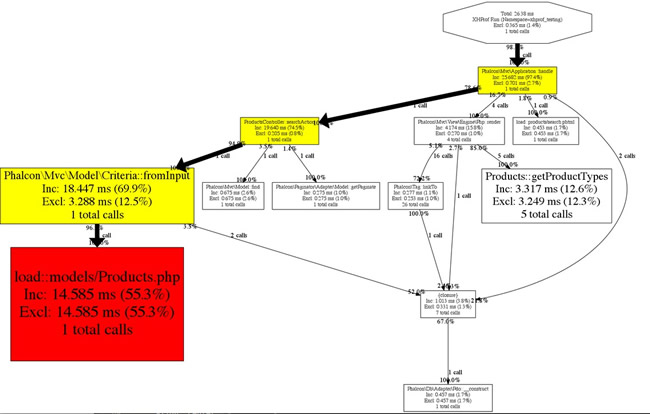
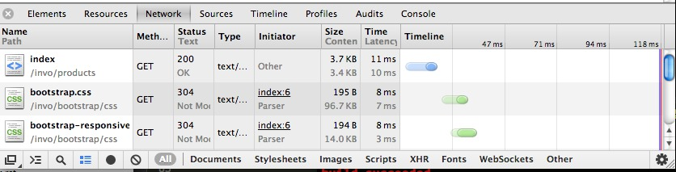
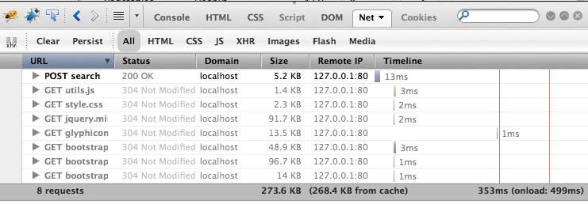

提高性能：下一步该做什么？（Increasing Performance: What's next?）
==================================================================

要开发出高性能的应用程序需要考虑多方面的因素： 服务器， 客户端， 网络， 数据库， web服务器，静态资源等。 本章中我集中分析在如何提升系统的性能及
如何检测应用的瓶颈。

关于服务端（Profile on the Server）
-----------------------------------
每种应用都有不同， 持久的性能分析对找出系统瓶颈是非常必要的。 性能分析可以让我们更直观的看出何处为性能瓶颈，何处不是。 性能分析在一个请示中和另一请求中可能表现
不一，所以要做出足够的分析及权衡方可给出结论。

关于 XDebug（Profiling with XDebug）
^^^^^^^^^^^^^^^^^^^^^^^^^^^^^^^^^^^^
Xdebug_ 提供了简易的性能测试的方式， 安装后可在php.ini中 进行如下配置：

.. code-block:: ini

    xdebug.profiler_enable = On

使用 Webgrind_ 可以分析出哪些函数或方法比其它的要慢：

关于 Xhprof（Profiling with Xhprof）
^^^^^^^^^^^^^^^^^^^^^^^^^^^^^^^^^^^^
Xhprof_ 也是一个非常有意思的扩展。 开发者可以添加如下的代码到启动文件中：

.. code-block:: php

    <?php

    xhprof_enable(XHPROF_FLAGS_CPU + XHPROF_FLAGS_MEMORY);

然后在启动文件的结尾保存性能分析数据：

.. code-block:: php

    <?php

    $xhprof_data = xhprof_disable('/tmp');

    $XHPROF_ROOT = "/var/www/xhprof/";
    include_once $XHPROF_ROOT . "/xhprof_lib/utils/xhprof_lib.php";
    include_once $XHPROF_ROOT . "/xhprof_lib/utils/xhprof_runs.php";

    $xhprof_runs = new XHProfRuns_Default();
    $run_id = $xhprof_runs->save_run($xhprof_data, "xhprof_testing");

    echo "http://localhost/xhprof/xhprof_html/index.php?run={$run_id}&source=xhprof_testing\n";

Xhprof 提供了一个内置的HTML视图用来对性能分析的数据进行展示：

.. figure:: ../_static/img/xhprof-2.jpg
    :align: center

关于 SQL 语句（Profiling SQL Statements）
^^^^^^^^^^^^^^^^^^^^^^^^^^^^^^^^^^^^^^^^^
几乎所有的数据库系统都提供了相关的工具以找出哪些执行缓慢的SQL语句。 检测及修复那些执行缓慢的查询对提高服务器端系统的性能来说是非常重要的。
在Mysql数据库中， 开发者可以启用慢查询日志来记录执行缓慢的查询：

.. code-block:: ini

    log-slow-queries = /var/log/slow-queries.log
    long_query_time = 1.5

关于客户端（Profile on the Client）
-----------------------------------
有时开发者需要提升静态资源加载的速度， 比如图片， javascript, CSS等。 下面的工具可以让开发者从客户端检测静态资源加载的瓶颈：

（使用Chrome/Firefox进行性能分析）Profile with Chrome/Firefox
^^^^^^^^^^^^^^^^^^^^^^^^^^^^^^^^^^^^^^^^^^^^^^^^^^^^^^^^^^^^^^^^^^^^^^^^^^^^^^^^^
几乎所有的现代浏览器都有相应的工具来检测页面加载时间。 Chrome中开发者可使用web探察器来获取一个页面的所有资源加载所需的时间：

Firebug_ 提供了类似的功能：

Yahoo! YSlow
------------
开发者可以使用 YSlow_ 对网页进行分析， YSlow给出基于 `rules for high performance web pages`_ （高性能网页规)的建议：

.. figure:: ../_static/img/yslow-1.jpg
    :align: center

使用Speed Trace进行性能分析(Profile with Speed Tracer)
^^^^^^^^^^^^^^^^^^^^^^^^^^^^^^^^^^^^^^^^^^^^^^^^^^^^^^
`Speed Tracer`_ 这个工具可以帮助开发者找出web应用性能方面的问题。 这个工个从浏览器的底层分析出web应用的性能。 Speed Tracer 这个插可以安装
在Ｗindows或Linux版本的Chrome上。

.. figure:: ../_static/img/speed-tracer.jpg
    :align: center

这是一个非常有用的工具，它可以为我们显示出html页面渲染的时间， Javascript及css执行(渲染)的时间等。

使用最新的 PHP 版本（Use a recent PHP version）
-----------------------------------------------
PHP本身的执行速度已经越来越快了， 使用最新版本的PHP及Phalcon可以更高的提升web应用的执行速度。

使用 PHP 字节码缓存（Use a PHP Bytecode Cache）
-----------------------------------------------
APC_ 像其它的字节码缓存工具一样可以帮助web应用程序减少读取及解析php文件解析所花的时间。 安装完APC之后在php.ini中添加如何配置：

.. code-block:: ini

    apc.enabled = On

PHP5.5中包含了一个内置的字节码缓存器，即 ZendOptimizer+, 这个扩展在5.3及5.4版本的php中也存在，只不过不是内置的而是用扩展的形式存在的。

将可能发生阻塞的操作放到后台运行（Do blocking work in the background）
----------------------------------------------------------------------
处理视频， 发送e-mail, 压缩文件和图片等是非常耗时的， 这些最好放在后台执行。 开发者可以使用队列及消息系统以提高web应用的性能，可使用如下组件：

* `Beanstalkd <http://kr.github.io/beanstalkd/>`_
* `Redis <http://redis.io/>`_
* `RabbitMQ <http://www.rabbitmq.com/>`_
* `Resque <https://github.com/chrisboulton/php-resque>`_
* `Gearman <http://gearman.org/>`_
* `ZeroMQ <http://www.zeromq.org/>`_

Google Page Speed
-----------------
mod_pagespeed_ 可以加速网站的运行速度及减少网站的加载时间。 这个开源的apache web服务器模块（nginx下为 ngx_pagespeed_ ）会
自动对网页，静态资源（CSS, JavaScript, images）等进行性能相关的优化，而无需开发者修改已存在的代码，内容，及工作流等。

注： 更多的性能相关的配置或建议可以查看具体的web服务器, 如apache中提供了mod_cache, mod_disk_cache等.

.. _firebug: http://getfirebug.com/
.. _YSlow: http://developer.yahoo.com/yslow/
.. _rules for high performance web pages: http://developer.yahoo.com/performance/rules.html
.. _XDebug: http://xdebug.org/docs
.. _Xhprof: https://github.com/facebook/xhprof
.. _Speed Tracer: https://developers.google.com/web-toolkit/speedtracer/
.. _Webgrind: https://github.com/jokkedk/webgrind/
.. _APC: http://php.net/manual/en/book.apc.php
.. _mod_pagespeed: https://developers.google.com/speed/pagespeed/mod
.. _ngx_pagespeed: https://developers.google.com/speed/pagespeed/ngx
