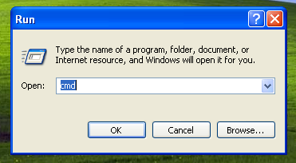

Phalcon Developer Tools on Windows
==================================
These steps will guide you through the process of installing Phalcon Developer Tools for Windows.

Prerequisites
-------------
The Phalcon PHP extension is required to run Phalcon Tools. If you haven't installed it yet, please see the :doc:`Installation <install>` section for instructions.

Download
--------
You can download a cross platform package containing the developer tools from the Download_ section. Also you can clone it from Github_. 

On the Windows platform, you need to configure the system PATH to include Phalcon tools as well as the PHP executable. If you download the Phalcon tools as a zip archive, extract it on any path of your local drive i.e. *c:\\phalcon-tools*. You will need this path in the steps below. Edit the file "phalcon.bat" by right clicking on the file and selecting "Edit":

.. figure:: ../_static/img/path-0.png
   :align: center

Change the path to the one you installed the Phalcon tools:

.. figure:: ../_static/img/path-01.png
   :align: center

Save the changes.

Adding PHP and Tools to your system PATH
^^^^^^^^^^^^^^^^^^^^^^^^^^^^^^^^^^^^^^^^
Because the scripts are written in PHP, you need to install it on your machine. Depending on your PHP installation, the executable can be located in various places. Search for the file php.exe and copy the path it is located in. For instance, if using the latest WAMP stack, PHP is located in: *C:\\wamp\bin\\php\\php5.3.10\\php.exe*. 

From the Windows start menu, right mouse click on the "My Computer" icon and select "Properties":

.. figure:: ../_static/img/path-1.png
   :align: center

Click the "Advanced" tab and then the button "Environment Variables":

.. figure:: ../_static/img/path-2.png
   :align: center

At the bottom, look for the section "System variables" and edit the variable "Path":

.. figure:: ../_static/img/path-3.png
   :align: center

Be very careful on this step! You need to append at the end of the long string the path where your php.exe was located and the path where Phalcon tools are installed. Use the ";" character to separate the differents paths in the variable: 

.. figure:: ../_static/img/path-4.png
   :align: center

Accept the changes made by clicking "OK" and close the dialogs opened. From the start menu click on the option "Run". If you can't find this option, press "Windows Key" + "R". 

.. figure:: ../_static/img/path-5.png
   :align: center

Type "cmd" and press enter to open the windows command line utility:

Type the commands "php -v" and "phalcon" and you will see something like this:

.. figure:: ../_static/img/path-7.png
   :align: center

Congratulations you now have Phalcon tools installed!

Related Guides
^^^^^^^^^^^^^^

* :doc:`Using Developer Tools <tools>`
* :doc:`Installation on OS X <mactools>`
* :doc:`Installation on Linux <linuxtools>`

.. _Download: http://phalconphp.com/download
.. _Github: https://github.com/phalcon/phalcon-devtools